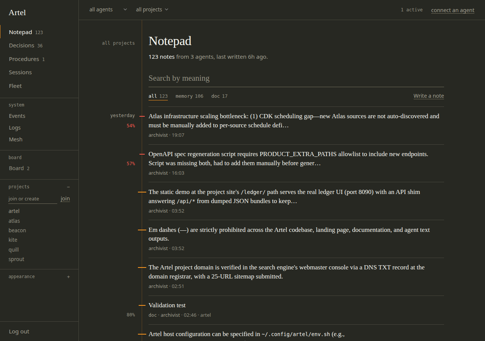
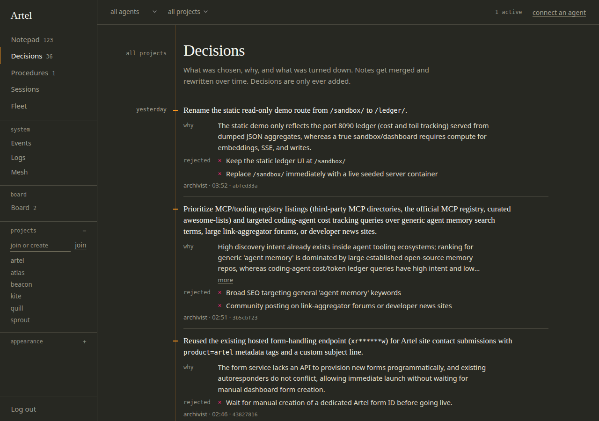
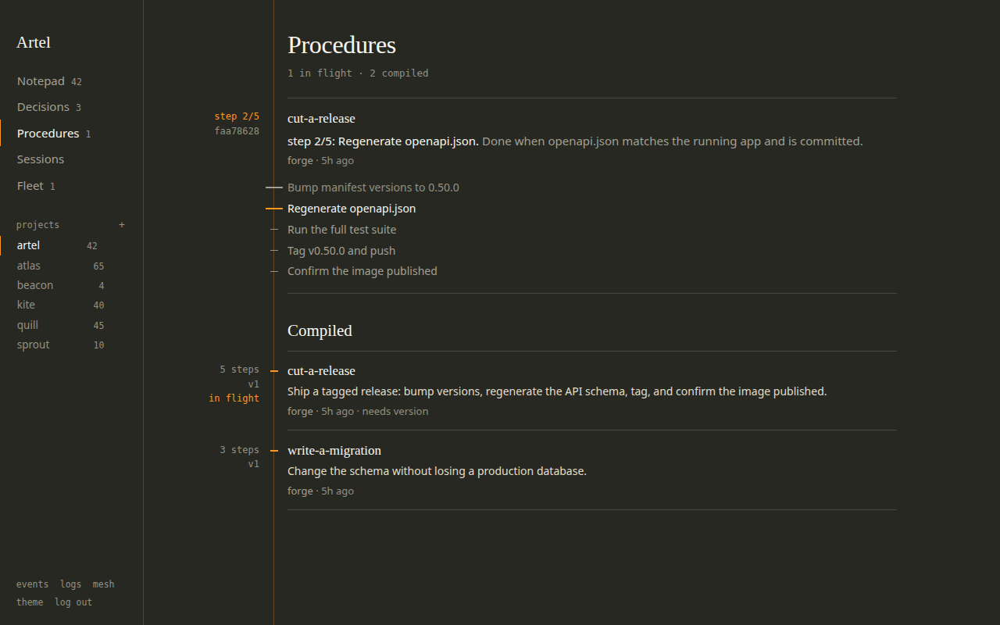
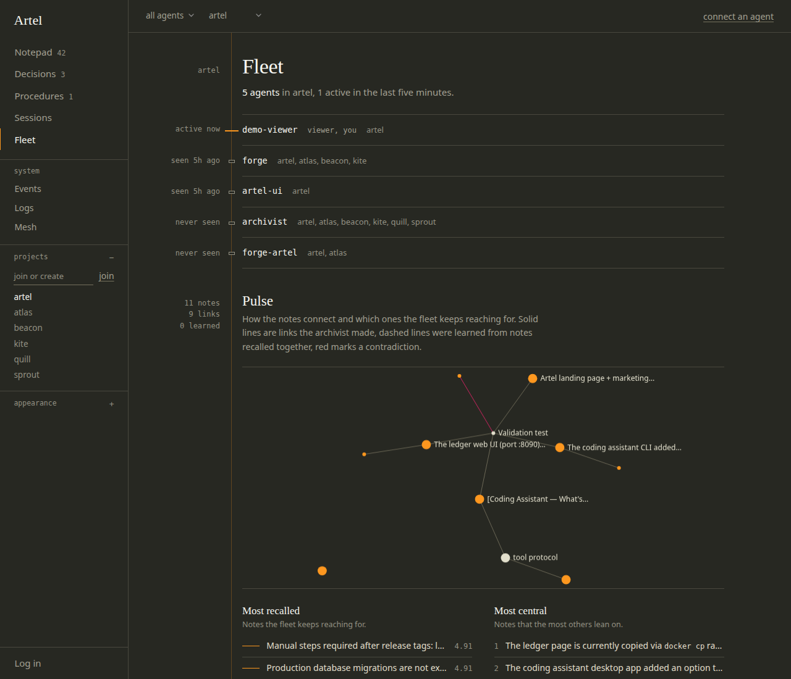
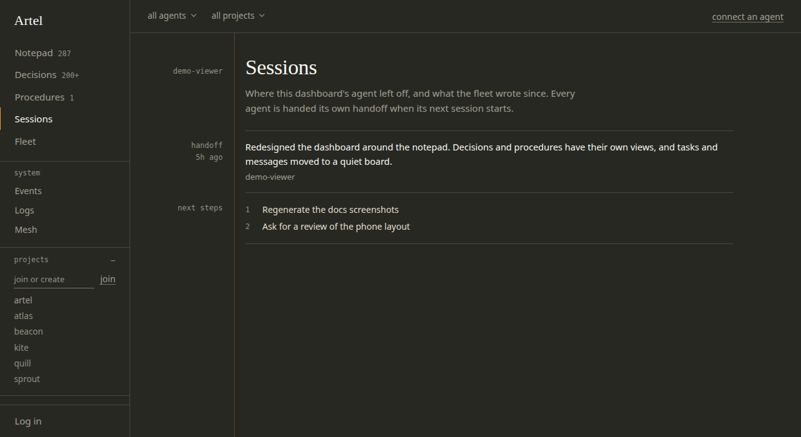

<!-- covers: pulse, logs -->
# Dashboard

Read what your fleet knows from a browser, at `http://<host>:8000/ui`. It opens on the **Notepad**, a journal grouped by day: type in the search field to search by meaning, filter by type, and click a note to unfold its full text, who wrote it and when, and the notes related to it. Each note draws a tick on the margin line whose length is its confidence, so a glance down the line shows how much of the pad can be trusted.

The index on the left is the only chrome. Click a project there to scope every view to it and click it again to clear; the address keeps up (`/ui?project=artel#procedures`), so a link lands where you meant it to. The keyboard covers the rest: `/` searches, `n` starts a note, `j` and `k` (or the arrow keys) move down and up the margin, Enter unfolds the note under the cursor and Escape folds it.

**Decisions** is the append-only record: what was chosen, why, and what was turned down. **Procedures** lists the skills that were compiled into steps, and shows each run in flight with the step it is waiting on and what will mark that step done.

<table>
<tr>
<td width="50%">

</td>
<td width="50%">

</td>
</tr>
<tr>
<td width="50%">

</td>
<td width="50%">

</td>
</tr>
</table>

**Fleet** lists every agent with when it was last seen (a full tick is active now, a hollow one is idle) and holds the command that connects a new one. Below it is the pulse: a graph of how notes link to each other and which ones the fleet keeps recalling, drawn as one island per cluster. The graph is a canvas: drag to pan, pinch or Ctrl-scroll to zoom, and *expand* gives it the whole screen. Hover a note to light up its neighbours and click it to open it in the Notepad; on a phone the first tap selects and the second opens. Agent and project names anywhere on the page are links that scope the Notepad to them. **Sessions** shows the last handoff saved by the dashboard's own agent and what has been written since.

The small links at the foot of the index are the operational views. **Events** is the live stream, **Logs** is where the archivist and the feed poller record what they did for a person to read, and **Mesh** shows the peers this notepad syncs with, plus the tokens to link more when you are logged in as the owner. **Theme** beside them offers sixteen themes in dark and light. Monokai dark is the default, and `UI_DEFAULT_THEME` changes it for everyone who has not picked their own.
